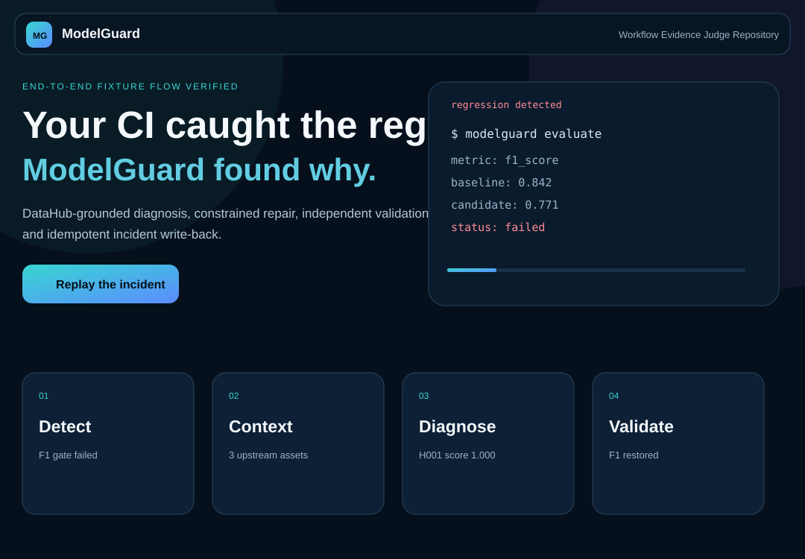
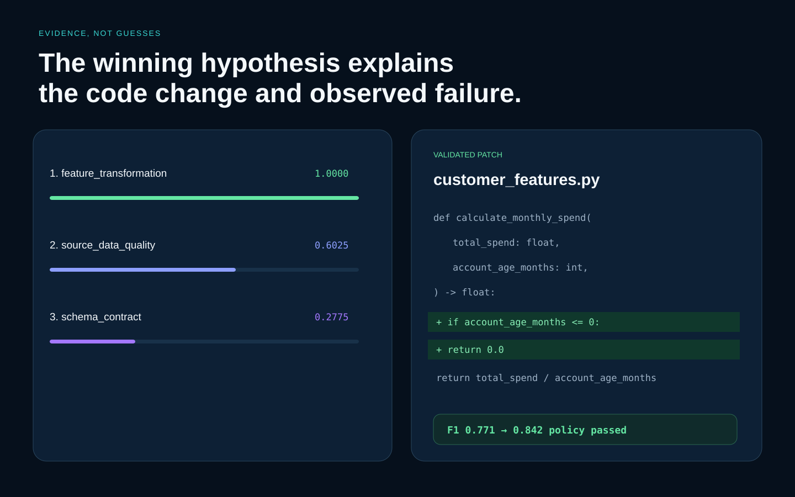

# ModelGuard: DataHub Production ML Agent

[](https://github.com/buriro-ezekia/modelguard-datahub/actions/workflows/modelguard.yml)
[](https://github.com/buriro-ezekia/modelguard-datahub/actions/workflows/pages.yml)
[](LICENSE)

> What if a CI/CD pipeline did not merely detect a model regression, but traced its cause through DataHub, proposed the smallest defensible repair, validated it independently and preserved the outcome for the next engineer or agent?

ModelGuard is a metadata-aware production ML agent. It turns a failed model-quality gate into an evidence-backed investigation, a constrained repair proposal and a durable operational record. DataHub supplies the schema, ownership, quality and lineage context; deterministic policies decide whether ModelGuard may diagnose, repair, validate or publish.

ModelGuard never merges its own repair. It produces a review-ready result while keeping the final decision with an engineer.

| Judge-facing resource | Link |
|---|---|
| Interactive demonstration | [Open the hosted demo](https://buriro-ezekia.github.io/modelguard-datahub/) |
| Demonstration video | [Watch the 2 minute 34 second video](https://youtu.be/S96pbK7k_nc) |
| Sample generated artefacts | [Inspect `examples/`](examples/) |
| Fast judging guide | [Read the judging guide](submission/JUDGING_GUIDE.md) |
| Reproduction instructions | [Read the testing instructions](submission/TESTING_INSTRUCTIONS.md) |
| Live DataHub verification | [Run SDK, MCP, ML lineage and write-back checks](submission/LIVE_DATAHUB_EVIDENCE.md) |
| Challenge category | **Production ML Agents** |



## Why ModelGuard exists

A production model can deteriorate because of a change that looks ordinary in code review: a removed boundary check, an altered schema, a null-handling mistake or a feature transformation that behaves badly at the edge of its valid range.

A conventional CI pipeline can report that a metric fell. It usually cannot explain which upstream asset mattered, distinguish the leading cause from plausible alternatives, test a narrowly scoped correction and write the resolved knowledge back into the metadata graph.

ModelGuard closes that gap. It behaves like a careful ML platform engineer: collect evidence first, consider competing explanations, act only inside explicit boundaries and verify every claim before publication.

## Verified demonstration

The deterministic showcase models a churn feature regression introduced by direct division in a feature transformation.

```text
F1 gate:               0.842 → 0.771 (failed)
DataHub context:       3 upstream assets, 1 downstream deployment
Leading diagnosis:     feature_transformation, score 1.0000, high confidence
Repair:                1 file, 2 added lines
Isolated validation:   3 targeted tests passed
Invalid values:        37 → 0
Recovered F1:          0.842
GitHub first/repeat:    created / noop
DataHub first/repeat:   raised_and_resolved / noop
```

These results are not typed into the website as unsupported claims. The one-command showcase executes the project CLI and writes the evidence, diagnosis, patch, validation and publication receipts to `artifacts/showcase/`. GitHub Actions checks the same expected outcome.

## Judge it quickly

### Fastest route: hosted demonstration

Open the [interactive demonstration](https://buriro-ezekia.github.io/modelguard-datahub/) and select **Replay the incident**. The site is a read-only replay of verified fixture artefacts, so it requires no login, token or external service.

### Reproduce the complete flow

```bash
python scripts/run_showcase.py
```

Expected summary:

```text
ModelGuard showcase complete
F1: 0.771 -> 0.842
Diagnosis: feature_transformation (1.0)
Repair: validated | guard=True
Publish: GitHub=created DataHub=raised_and_resolved
Repeat: GitHub=noop DataHub=noop
```

### Inspect the output without running anything

The [`examples/`](examples/) folder contains the generated JSON, Markdown and diff artefacts for every stage, including the root-cause report, validated repair, GitHub comment and DataHub incident record.

## Six guarded phases

```text
Failed model evaluation
        ↓
1. Detect: deterministic regression gate
        ↓
2. Context: DataHub schema, ownership, quality and lineage
        ↓
3. Diagnose: evidence registry and competing hypotheses
        ↓
High-confidence supported diagnosis?
   ├── No  → abstain; no repair
   └── Yes
        ↓
4. Repair: minimal constrained patch and static guard
        ↓
5. Validate: temporary workspace, compile, tests and model evaluation
        ↓
Metric restored within policy?
   ├── No  → withhold the patch
   └── Yes
        ↓
6. Publish: one GitHub review comment and one resolved DataHub incident
```

### 1. Detect

`modelguard evaluate` compares the candidate metric with an approved baseline. A regression beyond the configured tolerance returns exit status `1` and emits stable JSON. Agent reasoning cannot override this numerical gate.

### 2. Collect DataHub context

`modelguard context collect` resolves entity metadata, schema, ownership, quality signals and bidirectional lineage through one of three providers:

- DataHub Python SDK;
- DataHub MCP Server over Streamable HTTP; or
- deterministic fixture mode for CI and public evaluation.

### 3. Diagnose

`modelguard diagnose` extracts evidence, generates competing hypotheses and ranks them using temporal proximity, lineage relevance, metric explanation, quality corroboration and field specificity. Counter-evidence lowers unsupported explanations. Weak or ambiguous evidence causes explicit abstention.

### 4. Propose a constrained repair

`modelguard repair` currently supports the explicit `guarded_division` strategy used by the demonstration. It enforces path, file-count, line-budget, file-type and unsafe-token rules before a patch may proceed.

### 5. Validate independently

The patch is applied only inside a temporary copy. ModelGuard compiles the code, runs allow-listed tests and repeats the original metric evaluation. The source workspace is hashed before and after validation and must remain unchanged.

### 6. Publish once

`modelguard publish` requires a high-confidence diagnosis, an approved patch guard, a restored metric, matching repair identifiers and an unchanged source workspace. Publication is a dry run unless `--apply` is explicit. Stable delivery markers prevent duplicate GitHub comments and DataHub incidents.

## Why DataHub is essential

ModelGuard does not diagnose the failure from the changed line alone. DataHub gives it the connected operational picture:

- the path from raw customers to customer features, training data, the model and the production deployment;
- the schema and affected fields;
- ownership and quality signals;
- upstream and downstream relevance; and
- a place to preserve the resolved incident for later investigations.

This context changes the diagnosis. The unchanged zero-age source rows count as counter-evidence against blaming source data alone, while the changed feature transformation sits on the relevant lineage path and explains the 37 new infinite values.

## Demonstrated repair

```diff
 def calculate_monthly_spend(
     total_spend: float,
     account_age_months: int,
 ) -> float:
+    if account_age_months <= 0:
+        return 0.0
     return total_spend / account_age_months
```

The proposal changes two lines in one cited function. ModelGuard validates it in isolation and never applies or merges it into the source repository.



## Safety boundaries

- Deterministic metric detection precedes diagnosis.
- Root-cause ranking does not authorise a code change.
- Low-confidence or closely ranked diagnoses abstain.
- Only a cited file and approved repair strategy may be changed.
- `.github/`, `config/`, `scripts/` and `src/modelguard/` are protected from generated patches.
- Validation commands use `shell=False` and an allow-listed Python executable.
- Repairs are tested in a temporary workspace.
- The original workspace must remain hash-identical.
- The original metric policy must pass after repair.
- Publication remains a dry run unless `--apply` is supplied.
- Credentials come from environment variables and never enter receipts.
- Stable markers make GitHub and DataHub publication idempotent.
- ModelGuard never merges its own repair.

## Installation and local reproduction

### GitHub Codespaces

```bash
source scripts/bootstrap_codespace.sh
python scripts/run_showcase.py
```

### Local Python

Requirements: Python 3.11 or 3.12 and Git.

```bash
git clone https://github.com/buriro-ezekia/modelguard-datahub.git
cd modelguard-datahub
python -m venv .venv
source .venv/bin/activate  # Windows PowerShell: .venv\Scripts\Activate.ps1
python -m pip install --upgrade pip
pip install -e ".[dev]"
ruff check .
pytest
python scripts/run_showcase.py
```

The showcase requires no credentials and writes only to `artifacts/showcase/`.

## Live DataHub integration

Fixture mode makes judging reproducible, while the same provider interface supports real DataHub environments.

### Committed live SDK evidence

The repository contains a live DataHub Core SDK snapshot in [`examples/live_datahub_context.json`](examples/live_datahub_context.json). It records a real S3 dataset, one upstream data job and two downstream entities collected from a running DataHub instance. This proves live SDK connectivity and bidirectional lineage retrieval; it is separate from the deterministic ML-specific showcase.

### Complete live SDK, MCP and ML lineage verification

The live evidence harness creates a stable graph spanning raw data, feature jobs, training data, ML features, `churn-model-v3` and `churn-api-prod`. It then collects that context through both the SDK and the official self-hosted MCP Server, followed by live idempotent DataHub incident write-back.

```bash
pip install -e ".[dev,live]"
export DATAHUB_GMS_URL="http://localhost:8080"
unset DATAHUB_GMS_TOKEN
python scripts/run_live_datahub_evidence.py --promote
```

The required successful ending is:

```text
LIVE DATAHUB SDK, MCP, ML LINEAGE AND WRITE-BACK PASSED
```

See [`submission/LIVE_DATAHUB_EVIDENCE.md`](submission/LIVE_DATAHUB_EVIDENCE.md) for authenticated environments, managed MCP endpoints, generated artefacts and safety notes.

### DataHub Python SDK

```bash
pip install -e ".[datahub]"
export DATAHUB_GMS_URL="https://your-datahub.example.com"
export DATAHUB_GMS_TOKEN="scoped-service-account-token"
export MODELGUARD_DATAHUB_PROVIDER="sdk"
python -m modelguard context check --provider sdk
```

### DataHub MCP Server

```bash
pip install -e ".[mcp]"
export DATAHUB_MCP_URL="https://your-tenant.example.com/integrations/ai/mcp/"
export DATAHUB_MCP_TOKEN="scoped-service-account-token"
export MODELGUARD_DATAHUB_PROVIDER="mcp"
python -m modelguard context check --provider mcp
```

### DataHub incident write-back

```bash
export DATAHUB_GRAPHQL_URL="https://your-datahub.example.com/api/graphql"
export DATAHUB_GRAPHQL_TOKEN="scoped-incident-editor-token"

python -m modelguard publish \
  --diagnosis artifacts/diagnosis_report.json \
  --repair-plan artifacts/repair_plan.json \
  --validation artifacts/repair_validation.json \
  --patch artifacts/validated_patch.diff \
  --github-mode off \
  --datahub-mode live \
  --apply \
  --output artifacts/datahub_publication_receipt.json
```

Live context and publication remain opt-in. Use the smallest practical service-account scope and never commit tokens.

## Generated artefacts

The deterministic showcase writes:

- `evaluation.json`;
- `context_snapshot.json`;
- `diagnosis_report.json` and `root_cause_report.md`;
- `repair_plan.json`, `repair_validation.json` and `validated_patch.diff`;
- `publication_receipt.json`, `github_pr_comment.md` and fixture state files; and
- `showcase_summary.json`.

The optional live verification writes SDK, MCP, ML-lineage and write-back evidence under `artifacts/live_datahub_complete/` and can promote successful sanitised JSON to `examples/`.

Run the submission verifier with:

```bash
python scripts/verify_submission.py
```

## Current scope and honest limitations

ModelGuard is a focused hackathon implementation rather than a general autonomous coding system.

- The current repair catalogue contains one explicit strategy: `guarded_division`.
- The public website is an interactive replay, not a browser-based live DataHub client.
- The reproducible public showcase uses deterministic DataHub-shaped fixtures so judging needs no external service.
- Live SDK evidence is committed; complete MCP, ML-lineage and live write-back evidence must be produced against a configured DataHub instance with the supplied harness.
- Evidence extraction, candidate generation and ranking are deterministic, so the public evaluation needs no external model API.
- Live GitHub and DataHub writes require explicit permission and scoped credentials where authentication is enabled.

These limits are deliberate. They make the demonstrated claims reproducible and keep repair authority narrower than diagnostic context.

## Repository layout

```text
modelguard-datahub/
├── .github/workflows/       # CI and GitHub Pages deployment
├── config/                  # non-secret policies and thresholds
├── demo/                    # broken transformation and expected repair
├── docs/                    # hosted interactive demonstration
├── examples/                # verified outputs for every phase
├── scripts/                 # Codespaces bootstrap, showcase and live verification
├── src/modelguard/          # detection, context, diagnosis, repair and reporting
├── submission/              # judging, Devpost and video materials
└── tests/                   # unit, integration and regression coverage
```

## Project status

The hackathon build, hosted demonstration, public video, sample artefacts and submission documentation are complete. The repository includes tested SDK, MCP and GraphQL integration paths, committed live SDK lineage evidence, and a one-command harness for producing complete live MCP, ML-lineage and write-back evidence against DataHub Core or DataHub Cloud.

Before final submission, confirm manually that GitHub Pages and the video load in a private browser window and that the repository **About** section displays the Apache-2.0 licence and hosted website URL.

## Security

See [SECURITY.md](SECURITY.md) for vulnerability reporting and secret-handling guidance.

## Licence

Licensed under the [Apache License 2.0](LICENSE).
